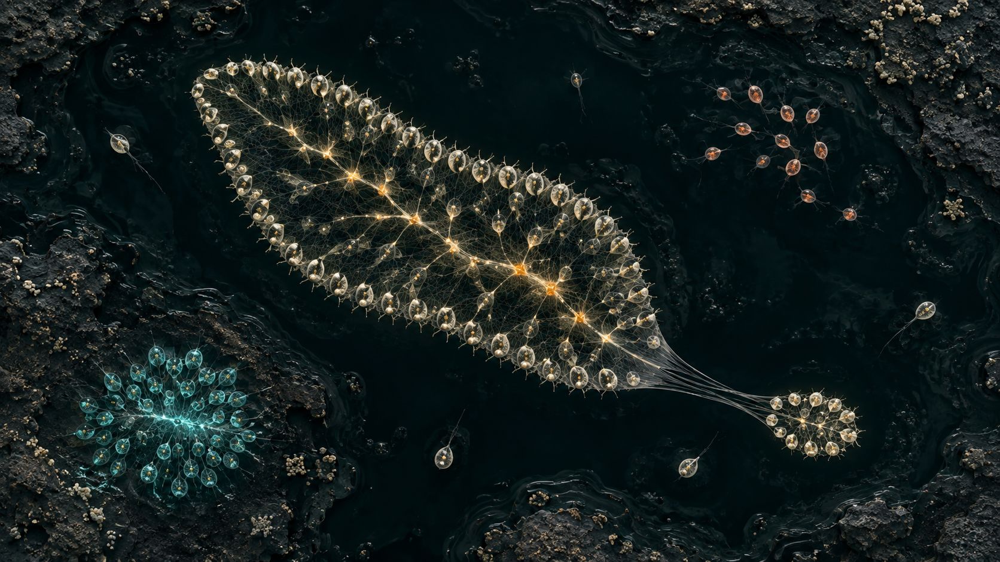

# Motes — the alien tidepool

**Date:** 6 September 2026  
**Status:** Proposal, with a bounded first proof. The new simulation is not implemented.  
**Brief:** Reimagine Motes with full creative autonomy. The finished, unchanging codebase must be fascinating to run and watch. Scheduled development and return incentives are outside this proposal.

## The decision

Make Motes a beautiful, explorable artificial-life world in which small creatures assemble into larger creatures.

A mote can survive alone. Bonded motes can share food, coordinate their movement, grow, and split. Their connections determine their anatomy. The same pulses that coordinate a body become its light and sound. Zooming in reveals that the animal you were following is a community; zooming out reveals communities competing for space and resources.

The central experience is recognising an unexpected behaviour, caring what happens next, and being able to discover why it happened.

The world should stand on its own with its source frozen. A seed, a set of rules, and your interventions supply its possibilities. Its inhabitants can change during a run; the project does not need to change for that to remain interesting.

## What the existing project tells me

The history repeatedly pursues observable personality, companionship, grief, collective music, and traces of lives. Those interests are the creative inheritance.

The present architecture restricts their expression:

- `src/config.ts` fixes the world at 256 × 144 pixels and 300 seconds.
- `src/mote.ts` largely confines movement to a one-dimensional terrain surface. Creatures can meet, but cannot assemble into spatial bodies.
- `src/colony.ts` chooses a common destination and ramps a global belonging drive. It also selects the hardiest living mote as the designated final survivor.
- `src/world.ts` changes energy decay to sustain that survivor while accelerating the others' decline.
- `tests/full-cycle.test.ts` explicitly verifies a guaranteed arc across three seeds: gathering, a prescribed population peak, and a single survivor near the end.

This is a coherent miniature performance. My judgement is that its repeated ending limits the kind of surprise the new brief asks for. More decorative layers will not change that constraint.

The July design had already recognised the danger of elaborate atmosphere surrounding uninteresting behaviour. Its response was stronger choreography. This proposal changes the underlying physical possibilities instead.

The existing baseline is healthy: on 6 September, all 33 tests in six files passed, and `npm run build` succeeded. I inspected fresh browser captures, but the accelerated capture script recorded only one of twelve requested phase frames; this was not a complete visual cycle audit. The source and passing full-cycle tests establish the arc described above.

## The experience to aim for

You open directly into a shallow, dark pool. Three or four clear shapes move through it. A pale ribbon flexes past an irregular mineral shelf. A turquoise rosette stays over a nutrient seam. A ragged coral-coloured group struggles against a current.

You follow the ribbon. At close range, each point of light has its own motion. A pulse moves through the connections. The body contracts in a travelling wave, and a soft phrase of sound follows the same wave.

The current stretches a thin neck. A fragment separates. You can follow either piece. The small one retains some of the parent's rhythm, but lacks its balance of feeding and moving cells. It might recover, attach elsewhere, or run out of energy.

You rewind to the rupture, ease the current, and let the alternative unfold beside the original.

This is an intended encounter, not a promised sequence for every seed. Fragment survival, distinct body shapes, and useful coordinated movement must be demonstrated by the model before they become product claims. Neither the camera nor a story controller may decide who survives.

The concept image establishes composition and cellular legibility. Its surface detail is aspirational; it is not a browser performance or rendering benchmark. [Generation method and full prompt](assets/motes-tidepool-concept-prompt.md).

## The small set of rules that earns the spectacle

| Rule | Consequence | Visible evidence |
|---|---|---|
| Cells have local sensing, polarity, and energy costs | Movement has direction and a price | A cell turns toward a nearby resource gradient; active cells lose stored brightness |
| Compatible neighbours form elastic, breakable bonds | Relationships become anatomy | Connected chains bend, stretch, rupture, and reconnect |
| Bonds transfer stored energy at a limited rate | Feeding one end can sustain another | Light moves through the actual transfer paths |
| Cells have internal pulse phases, coupled through neighbours | Coordination can develop or fail | Travelling waves, synchronised contractions, conflicting rhythms |
| Cells divide only when local energy and space allow | A body can grow without a population script | A bud consumes a parent's reserves and adds a real cell |
| Division copies bounded traits with small mutations | Descendants can differ in measurable ways | Different adhesion, pulse timing, polarity response, and energy allocation |
| Death returns material to a local resource pool | A failed colony changes nearby opportunities | Detritus appears where cells died and can be consumed |

Start with three costly capabilities: absorbing resources, producing thrust, and maintaining strong connections. Use constrained trait allocations so one cell cannot be best at everything. Initial lineage presets are authored and disclosed. Distinct viable morphologies should be discovered and tuned within these rules; there is no `becomeJellyfish()` instruction.

Movement needs an explicit propulsion model. Symmetric springs alone cannot make a body swim. Motile cells apply energy-paid thrust along their polarity; pulse phase gates that thrust. Local sensing adjusts polarity, and drag/current act against motion. This is a stylised active-matter model, not a fluid-dynamics claim.

The first release does not depend on learning, open-ended evolution, predation, or evolving neural networks. Mutation and selection are later additions after growth, coordination, and survival work. Inheritance alone should never be presented as intelligence.

Resource supply is explicit: bounded environmental input replenishes nutrient patches, feeding depletes them, movement and maintenance dissipate energy, and death recycles a defined material fraction. Bond transfers cannot create energy. Both isolated cells and excessively dense colonies need meaningful costs, preventing universal clumping from becoming the only successful strategy.

## Sound belongs to the biology

Every colony has a pulse structure that affects its movement. Audio translates this structure into a bounded set of voices: phase crossings trigger notes, coordination affects tonal stability, and strain changes timbre. A split can produce two related rhythms because the underlying phases and traits were inherited.

The mapping still needs musical composition: pitch limits, sparse voice selection, envelope design, silence, and a restrained harmonic vocabulary. Avoid assigning an audible oscillator to every cell. The simulation runs identically when muted; the audible waveform does not feed back into the model. Light and movement carry the same information for silent viewing.

## Watching, inspecting, intervening

The default view is almost entirely the world. It begins from a disclosed, curated initial state with active bodies already visible. A viewer can also start from dispersed cells and see assembly. Loading a prepared state is acceptable; pretending the viewer witnessed its formation is not.

Camera motion is slow and optional. Following a colony preserves identity through small changes; a major split presents both descendants instead of silently choosing a new subject. A manual camera and reduced-motion mode remain available.

Inspection is a temporary lens, not a permanent dashboard. It reveals the selected body's cells, bonds, energy flow, and pulse timing. Short observations describe recorded facts: a bond ruptured, feeding stopped, a fragment survived. Emotional interpretation belongs to the viewer.

Three interventions are sufficient initially: place a finite nutrient patch, disturb a local current, and sever a connection. Each has an immediate visible footprint and is recorded at an exact simulation step.

Rewind and branching make causality explorable. A branch restores the same complete checkpoint and applies one changed intervention. Both versions then obey the same rules. Export contains the model version, starting state, random state, and ordered interventions. This is a self-contained experiment, with no account or service required.

## What to retain and replace

Retain the name, intimacy, procedural construction, small autonomous units, spatial-neighbour approach, fixed-step discipline, and generative audio expertise. Existing PRNG and audio utilities are useful starting points. Existing rendering knowledge is valuable even where the code cannot be reused directly.

Replace the surface-bound movement, universal gathering point, phase-controlled mortality, 300-second reset, and 256 × 144 display ceiling. Replace atmospheric effect accumulation with a small visual vocabulary that explains cells, tissue, resources, and stress. Old arc-specific tests describe the old work and should stay with it.

The new world occupies a two-dimensional plane with irregular obstacles and a coarse field for resources and current. The camera can move between individual cells and the whole pool. Depth, refraction, and emissive edges are rendering choices; three-dimensional physics is unnecessary.

Do not estimate reuse as a percentage. The simulation core is a substantial replacement. Build the new proof at a separate route so it can be compared against the original before making it the main experience.

## Architecture and practical limits

The headless simulation owns cells, bonds, resources, current, random streams, and the exact step counter. It accepts commands and emits factual events. Rendering, audio, camera selection, and interface consume that state without changing it.

Use stable numeric IDs for cells and bonds, explicit birth and split events for lineage, and deterministic neighbour ordering. Separate random streams by subsystem and entity so one intervention does not arbitrarily reshuffle every unrelated random draw. Checkpoints include all timers, phase values, topology, fields, and random state.

Start with a CPU implementation at a fixed step and 128–256 cells. Add a worker and typed buffers when profiling justifies them. The first visual proof can use Canvas 2D. A WebGL2 renderer can later provide instanced cells, tissue contours, and controlled bloom without moving the authoritative simulation to the GPU.

A later working target is approximately 1,000 visible cells at 60 rendered frames per second on this desktop, with simulation time measured separately. That is a target to benchmark, not a verified capacity. Lower visual resolution before silently changing model rules. Do not promise bit-identical cross-browser replays until state checksums have passed on the supported engines; version every export.

Checkpoints and command logs should have explicit memory limits. A useful initial scope is a rolling two-minute rewind window with exportable selected checkpoints, rather than unlimited history.

## Three directions considered

| Direction | Attraction | Trade-off | Decision |
|---|---|---|---|
| **Alien tidepool: colonies become organisms** | Physical surprise, recognisable subjects, music and anatomy tied to the same rules | Requires a new simulation core and proof of useful morphology | **Choose this** |
| Tiny civilisation with tools, construction, traditions, and competing settlements | Closest to the existing social interests; richer individual stories | Many authored behaviours, pathfinding and economy systems; risk of complexity that is hard to see | A different project, less focused on immediate visual wonder |
| Pure continuous artificial-life field | Fast route to remarkable organic motion and self-organisation | Individual identity, attachment, mixed species, and causal inspection are harder to control | Research reference, not the primary implementation |

## The first proof: the colony that crosses the dark

Build one pool, one movable nutrient source, one narrow channel, and a modest current. Use 128–256 cells with resource absorption, costly propulsion, breakable energy-sharing bonds, and coupled pulses. Begin with two documented initial conditions: a prepared colony and dispersed cells.

The proof must answer four concrete questions:

1. Can local rules produce or maintain an identifiable body that moves usefully toward resources, rather than only rotating, shaking, or collapsing into a ball?
2. Does coupling improve some measurable property of collective motion or survival compared with the same starting state with coupling disabled?
3. Does changing or severing a connection change energy transport and physical behaviour in a way a viewer can see?
4. Can a checkpoint reproduce both the original run and an intervention branch?

Observe at natural speed and without explanatory text. Then inspect the state to verify the perceived cause. Test multiple seeded starting configurations, including unfavourable ones; report failures rather than selecting only a showcase seed. A curated opening may be chosen from documented successes after that evaluation.

Numerical checks cover bounded energy, transfer accounting, finite positions, symmetric bond bookkeeping, complete checkpoint restoration, and deterministic replay for the target runtime. Behavioural evidence should include trajectories, energy histories, topology changes, and comparison clips. A green test suite cannot establish that the piece is compelling to watch.

**Stop condition:** if the proof yields only undifferentiated blobs or coordinated motion without meaningful consequences, revise the rule system. Do not proceed by adding scenery, narrative claims, or more glow.

Once the proof works, build one complete polished encounter with three distinguishable colony presets, restrained sound, follow/inspect, and rewind. Only then add division, trait inheritance, competing resource strategies, and additional terrain. The first encounter must already be worth watching before those expansions.

## Research grounding

- [Particle Lenia — Mordvintsev, Niklasson and Randazzo](https://google-research.github.io/self-organising-systems/particle-lenia/) demonstrates complex moving structures from local particle rules and includes sonification experiments. It supports exploring particle-based bodies; it does not establish this proposed ecology or its performance.
- [Oscillators that sync and swarm — O'Keeffe, Hong and Strogatz](https://arxiv.org/abs/1701.05670) studies coupled spatial and phase dynamics. It supports the idea that pulse and motion can share a mechanism. The motile bonded-cell model proposed here is a separate design to validate.
- [Flow-Lenia — Plantec and colleagues](https://arxiv.org/abs/2212.07906) explores mass conservation and local rule parameters for multi-species artificial life. It informs resource accounting and trait locality; open-ended evolution remains outside the first release promise.

These are precedents, not evidence that combining their ideas will automatically work. The original contribution would be the coherent viewing and investigation experience: recognisable cellular bodies, consequential relationships, audible coordination, and replayable interventions.

## Success

A silent thirty-second encounter should make you notice a particular organism and want to follow it. A few minutes should reveal a consequence you did not predict. Inspection should make that consequence more interesting by exposing its mechanism. Replaying it should let you test your explanation.

That is the bar for Motes: a small world whose rules reward attention.
